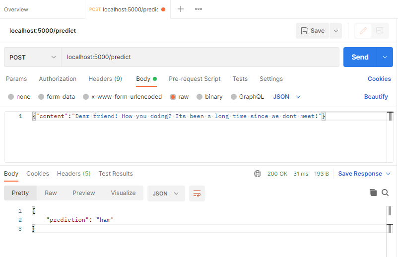
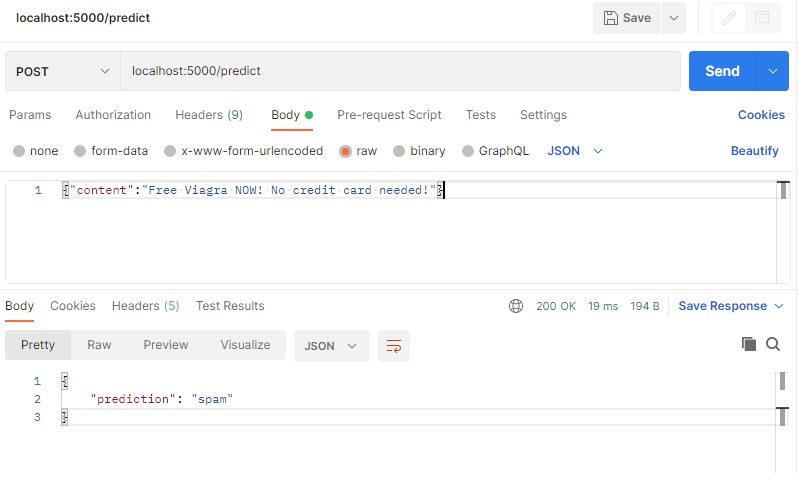

<br/>
<div align="center">
  <h1 align="center">Spam Classifier with Naive Bayes</h1>
</div>


<!-- ABOUT THE PROJECT -->
## About The Project

In this project we are going to:
* Create a Spam Classifier with Naive Bayes Classifier
* Create a simple Flask application
* Create a Docker container to run our classifier


### Built With

* [Python](https://www.python.org/)
* [Sklearn](https://scikit-learn.org/)
* [Flask](https://flask.palletsprojects.com/en/2.1.x/)
* [Pandas](https://pandas.pydata.org/)
* [Numpy](https://numpy.org/)
* [Pickle](https://docs.python.org/3/library/pickle.html)
* [Docker](https://www.docker.com/)


### Naive Bayes Classifier
Naive Bayes is a classification technique that is based on Bayes’ Theorem with an assumption that all the features that predicts the target value are independent of each other. It calculates the probability of each class and then pick the one with the highest probability. It has been successfully used for many purposes, but it works particularly well with natural language processing (NLP) problems.

 

In order to train our model we used the <b>"spam_data.csv"</b> file, containing both ham and spam email content. In the <b>"train.py"</b> you will find the complete code used to train and save the trained model to a pickle file. Sklearn has a very good module for using Naive Bayes methods, you can check its documentation by <a href = "https://scikit-learn.org/stable/modules/naive_bayes.html">clicking here</a>.
<hr>

### Flask

Flask is a web application framework written in Python. It has multiple modules that make it easier for a web developer to write applications without having to worry about the details like protocol management, thread management, etc.

Because of its simplicity, its a very known tool when creating APIs and deploy ML models, as we are gonna see.
<hr>

### Docker

Docker is an open source containerization platform. It enables developers to package applications into containers-standardized executable components combining application source code with the operating system (OS) libraries and dependencies required to run that code in any environment.
<hr>

## Getting Started
#### 1. Running a Container
To run it with Docker just build the Dockerfile as follows:
```
  docker build -t "name of your image" .
  ```
And then, run:
```
  docker run -i -d -p 5000:5000 "name of your image"
  ```
  
#### 2. Running Locally
If you want to run it locally instead, do the following:
```
  git clone https://github.com/nicholascomuni/Spam-Classifier
  cd Spam-Classifier
  pip install -r requirements.txt
  ```
  
Run the flask application:
  ```
  flask run --host 0.0.0.0
  ```
<hr>

## Usage
Once the flask app is deployed and running localy or on a server, you can request a spam/ham classification by sending to the "/predict" endpoint a POST request, it has to contain the body of the email in JSON syntax as follows:
```{'content':"email body"}```. As a response you will get the predicted class!

<b>Sending the POST request:</b>
```
curl --location --request POST 'localhost:5000/predict' \
--header 'Content-Type: application/json' \
--data-raw '{"content":"Dear friend! How you doing? Its been a long time since we dont meet!"}'
```
<b>Server Response</b>
```
{
    "prediction": "ham"
}
```


<hr>




## References

https://medium.com/analytics-vidhya/na%C3%AFve-bayes-algorithm-5bf31e9032a2

https://scikit-learn.org/stable/modules/naive_bayes.html

https://www.ibm.com/cloud/learn/docker

